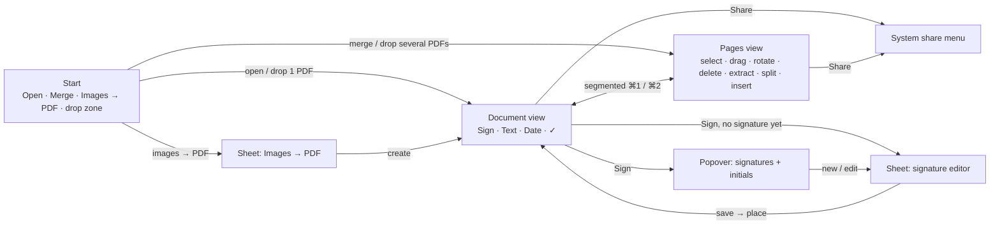

# UX analysis and redesign — PDFsPDFsPDFs

Status: 2026-10-07 · Audit of v1.1.0 plus target structure for v2.0.
Validation is **heuristic** (code reconstruction, offscreen renders of every state, click-count walkthroughs). It does not replace a test with real users.

## 1. Context and top tasks

**Who:** a person on a Mac with a mouse or trackpad who received a PDF (contract, form, offer, scan) and wants to be done with it quickly. They are not PDF power users. Sessions are short (1–3 min) and goal-driven: get it signed, filled in, trimmed or combined, then send it back.

| Tier | Task | Frequency × importance |
|---|---|---|
| **T1** | Sign a PDF (signature, initials) and send it back | weekly, critical |
| **T1** | Fill in a PDF: form fields, free text, date, tick boxes | weekly, critical |
| **T2** | Merge several PDFs into one, in the right order | monthly |
| **T2** | Cut pages: delete pages, extract pages, split into parts | monthly |
| **T2** | Reorder and rotate pages (scans) | monthly |
| **T3** | Images → PDF, PDF → images | occasionally |
| **T3** | Create or edit a signature (one-time setup) | rarely |
| **T3** | Print | rarely |

Budget: T1 ≤ 3 clicks including the action, T2 ≤ 3, T3 ≤ 5. Typing and file dialogs are counted separately.

## 2. Objects and names

| Object | Name in the UI (de / en) | Note |
|---|---|---|
| Document | Dokument / Document | the open PDF, also unsaved (merge result) |
| Page | Seite / Page | the unit for every cut/merge/rotate operation |
| Signature | Unterschrift / Signature | belongs to a person, has an optional pair of initials |
| Placed element | (no own name) | signature, text, date or tick placed on a page |
| Cut mark | Schnitt / Cut | between two pages, defines the parts for splitting |

One name per object everywhere. "Person" was a name users had to understand before they could sign; it now only appears as the optional name on a signature.

## 3. Current structure (v1.1)

```
Window
├─ Tool rail (icons only): Sign · Pages · Merge · Split · Text & Date · Convert
├─ Tool panel (300 pt, one per rail icon)
│   ├─ Sign: people list → "Place signature"/"Place initials"; "Add person" → sheet → draw sheet (stacked)
│   ├─ Pages: thumbnails; rotate/move/extract/delete only via right-click
│   ├─ Merge: own file list, ↑↓ buttons, save dialog
│   ├─ Split: typed range "1-3, 5", or "every page as a PDF"
│   ├─ Text & Date: tool toggle, size slider, "insert today's date"
│   └─ Convert: images → PDF / PDF → images with options
├─ PDF view with hint banner on top
└─ Toolbar: open · save (overwrites) · print · undo · redo · contextual size/rotate/delete
```

Page work has three homes (Pages, Split, Merge), and the rail mixes document tools with standalone utilities.

## 4. Audit findings

| # | Sev | Finding | Fix in v2 |
|---|---|---|---|
| F1 | P1 | Page work is split across three panels (Pages, Split, Merge); the user must know which one holds "delete page", "extract" or "merge". | One **Pages** view for every page operation. |
| F2 | P1 | Rail is icon-only; Merge and Convert icons are ambiguous; labels only as hover tooltips. | Labelled tools in the toolbar. |
| F3 | P1 | Delete, rotate, move and extract a page are hidden in a right-click menu; no multi-select; moving goes one step at a time. | Grid with click/⇧/⌘ selection, drag to reorder, visible buttons, ⌫ deletes. |
| F4 | P1 | Extracting pages requires typing a range ("1-3, 5") while the pages are visible right next to it. | Select pages → "Save as PDF". |
| F5 | P1 | Dropping several PDFs onto the window opens only the first and replaces the current document; the merge list accepts no drops. | Drop several PDFs = merge; drop into the page grid = insert at that position. |
| F6 | P1 | Drawing sheet opens on top of the person sheet (stacked modals). | One sheet with an inline canvas. |
| F7 | P1 | First signature: 7 clicks, a mandatory name and two sheets before anything is placed. | "Sign" opens the editor directly when no signature exists; name optional; placing starts right after saving. |
| F8 | P1 | Text tool stays active after switching panels; a click on the page in another panel opens a text field (hidden mode). | Tools are exclusive and visible in the toolbar; switching to Pages ends every tool. |
| F9 | P1 | No way to send the result; "sign and send back" ends in Finder/Mail. ⌘S overwrites the original (flattened, undo cleared). | **Share** button exports a signed copy and opens Mail/Messages/AirDrop; the original stays untouched. |
| F10 | P2 | No tick or cross for scanned forms without fields. | "✓" tool (✓ / ✗). |
| F11 | P2 | Placing shows only a crosshair; the size is visible only after the click. | Semi-transparent preview follows the cursor. |
| F12 | P2 | Fillable forms are not announced. | Hint "This PDF has N form fields" when opening. |
| F13 | P2 | Long help banner instead of controls ("corners = resize · blue grip = rotate …"). | Floating context bar with real controls (size, rotate, delete). |
| F14 | P2 | Merge list shows file names only and sorts via ↑↓. | Merge result opens in the page grid: thumbnails, drag to sort. |
| F15 | P2 | Start screen offers only "Open PDF"; merging and images → PDF are hidden in panels. | Start screen with the three starting jobs plus a drop zone. |
| F16 | P2 | Contracts often need initials on every page; only manual, page by page. | "Initials on every page" in the signature menu. |
| F17 | P3 | Print, undo and redo occupy the toolbar although all have shortcuts. | Moved to the menus (⌘P, ⌘Z, ⇧⌘Z). |
| F18 | P3 | Grey panel headers on grey panels; weak hierarchy. | Native toolbar, white canvas, one accent per screen. |

## 5. Target structure (v2.0)



**Navigation grammar:** two peer views of the same document (segmented control, ⌘1/⌘2). Choosing a signature is a popover (quick pick, document stays visible). Creating a signature and images → PDF are sheets with Cancel/Save. Destructive and ambiguous actions use a confirmation dialog. No stacked modals.

| Screen | Kind | Primary action | Secondary (≤ 3 visible) |
|---|---|---|---|
| Start | Hub | Open PDF | Merge PDFs, Images → PDF, recents |
| Document | Mode | Sign | Text, Date, ✓; Share/Save in the toolbar |
| Pages | Collection | (selection-dependent) Save as PDF | Rotate, Delete, Split, Insert PDF |
| Signatures popover | Picker | Place signature | Initials, Initials on every page, New |
| Signature editor | Task sheet | Save | Draw / Type / Image |

## 6. Walkthroughs before → after (click counts)

| Task | v1.1 | v2.0 | Budget |
|---|---|---|---|
| Sign (signature exists) and send | open + dialog · rail · "Place signature" · click page · ⌘S · *leave the app to send* = **5 + leaving the app** | open + dialog · Sign · tile · click page · Share · Mail = **5, ends sent** | T1 ✅ |
| First signature | rail · Add person · *type name* · Draw… · *2nd sheet* · Apply · Done · Place · click = **8 + typing** | Sign · *draw or type* · Save · click = **3** | T1 ✅ |
| Free text | rail · tool toggle · click · type = **3** | Text · click · type = **2** | T1 ✅ |
| Tick a box (no form) | not possible (type "X" with the text tool: 3) | ✓ · click = **2** | T1 ✅ |
| Merge 3 PDFs | rail · Add · dialog · ↑↓ × n · Merge & save · dialog = **3 + n + 2 dialogs** | drop 3 files · drag to sort · Save + dialog = **1 + drags** | T2 ✅ |
| Delete pages 2–3 | rail · right-click · Delete · right-click · Delete = **5** (hidden) | Pages · click · ⇧-click · ⌫ = **4** | T2 ⚠ (+1, but visible) |
| Extract pages 1–3 | rail · *type "1-3"* · Save as PDF + dialog = **2 + typing** | Pages · click · ⇧-click · Save as PDF + dialog = **4, no typing** | T2 ✅ |
| Cut into two parts after page 3 | 2 × (rail · type range · save + dialog) = **4 + 2 × typing + 2 dialogs** | Pages · ✂ between 3 and 4 · Split + folder = **3** | T2 ✅ |
| Move page 10 to the front | 9 × (right-click · Move up) = **18** | Pages · drag = **2** | T2 ✅ |

## 7. Build packages

1. **Model:** page operations on sets of pages with undo (delete, rotate, move, insert, split at cut marks), untitled documents, exclusive tools, ghost preview, export for sharing.
2. **Shell:** start screen with drop zone, window toolbar with view switch, Save and Share, menus (⌘1/⌘2, undo/redo, export).
3. **Document view:** tool buttons, signature popover, floating context bar, form hint, ✓/✗, initials on every page, thumbnail strip for navigation.
4. **Pages view:** grid with selection, drag to reorder, file drops, cut marks, actions.
5. **Signature editor:** one sheet, draw / type / image, name optional.
6. **Converter as sheets:** images → PDF (start screen, drop) and PDF → images (File › Export).
7. **Verification:** self-test extended for the new page operations; offscreen renders of every state (`--snapshot`, debug builds only).

## 8. Implementation status (2026-10-07)

All seven packages are built. Verification so far:

- `--selftest` passes, including new tests for moving, deleting, rotating and inserting pages with undo/redo, range and toggle selection, splitting at cut marks (cuts follow their page when pages move), initials on pages rotated 0/90/180/270°, and the share export (signed file name, no placement preview in the output).
- `--snapshot` renders 15 fixed states (light, dark, narrow window) from the real window incl. toolbar; reviewed visually.
- Found and fixed on the way: custom stamps ignored page rotation and crop box when drawn (PDFKit passes custom annotations an untransformed context), so signatures on rotated scans landed in the wrong place or outside the page after saving — a v1.1 bug. Newly placed stamps were also not always repainted until the next mouse move.

Open for a real-user check: drag-to-reorder and file drops in the page grid, the share menu (Mail/AirDrop), the inline text editor on rotated pages.
